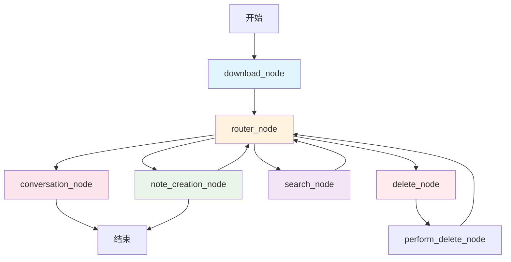

# 小红书文案生成 CoAgent

这是一个基于 CopilotKit 和 LangGraph 的智能小红书文案生成系统，集成了 RAG(Retrieval-Augmented Generation) 文案库检索功能。

## 🌟 功能特性

- **📝 智能文案生成**: 基于产品信息和用户需求生成小红书文案
- **👤 博主人设创建**: 自动生成符合产品特色的博主人设
- **📚 文案库检索**: 集成 RAGFlow，从真实文案库中检索相关示例
- **📋 Brief 解析**: 支持上传 Brief 表格，自动解析产品信息
- **🔍 智能搜索**: 搜索竞品信息和市场趋势
- **🎯 多样化风格**: 支持种草、测评、教程、生活方式、开箱等多种笔记风格

## 🏗️ 系统架构

### LangGraph 工作流程图



### 节点功能说明

| 节点名称 | 功能描述 | 路由目标 |
|---------|---------|---------|
| **download_node** | 处理文件下载和Brief数据解析 | → router_node |
| **router_node** | 智能意图识别和消息路由 | → conversation_node/note_creation_node/search_node/__end__ |
| **conversation_node** | 处理普通对话和功能咨询 | → END |
| **note_creation_node** | 核心文案生成和RAG检索 | → router_node/__end__ |
| **search_node** | 外部搜索和竞品分析 | → router_node |
| **delete_node** | 删除参考素材确认 | → perform_delete_node |
| **perform_delete_node** | 执行删除操作 | → router_node |

### 工具系统

#### note_creation_node 可用工具

- **WriteXiaohongshuNote**: 创作小红书笔记内容
- **WriteProductInfo**: 填写/更新产品信息
- **GenerateBloggerPersona**: 生成博主人设
- **RetrieveFromKnowledgeBase**: 🆕 从文案库检索相关示例
- **Search**: 搜索外部参考资料
- **AnalyzeCompetitors**: 分析竞品内容
- **DeleteReferenceMaterials**: 删除参考素材

## 🔧 RAG 检索系统

### 架构设计

```
用户输入 → router_node → note_creation_node → RetrieveFromKnowledgeBase Tool
                                                           ↓
RAGFlow API ← rag_retrieval_node ← RAGFlowProvider ← build_retriever
     ↓
返回相关文案示例 → 格式化输出 → 用户界面
```

### 核心组件

#### 1. RAG 模块 (`research_canvas/rag/`)

- **`retriever.py`**: 抽象检索接口定义
- **`ragflow_provider.py`**: RAGFlow API 集成实现
- **`builder.py`**: RAG 提供者构建器

#### 2. RAG 节点 (`research_canvas/langgraph/rag_node.py`)

- **查询构建**: 从 Brief 数据和产品信息智能构建检索查询
- **资源管理**: 支持多数据集配置和资源构建
- **结果处理**: 相似度过滤和格式化输出

### 检索流程

1. **状态检查**: 验证 Brief 数据或产品信息是否存在
2. **查询构建**: 提取关键信息构建智能检索查询
3. **资源构建**: 根据配置构建 RAGFlow 资源列表
4. **API调用**: 调用 RAGFlow API 进行文档检索
5. **结果过滤**: 基于相似度阈值过滤结果
6. **格式化**: 返回结构化的文案示例

## 🚀 快速开始

### 环境配置

1. 复制环境配置文件：
```bash
cp agent/.env.example agent/.env
```

2. 配置必要的环境变量：
```bash
# DeepSeek 配置
OPENAI_API_KEY=your_openai_api_key
OPENAI_BASE_URL=https://ark.cn-beijing.volces.com/api/v3
DEEPSEEK_MODEL=your_model_name

# RAG 配置
RAG_PROVIDER=ragflow
RAGFLOW_API_URL="http://your_ragflow_server:port"
RAGFLOW_API_KEY="your_ragflow_api_key"
XHS_DATASET_ID="your_dataset_id"

# RAG 参数调优
XHS_MAX_RESULTS=10          # 最大检索结果数
XHS_SIMILARITY_THRESHOLD=0.3 # 相似度阈值
```

### 启动服务

#### 1. 启动 Agent 服务
```bash
cd agent
python -m research_canvas.langgraph.agent
```

#### 2. 启动 UI 界面
```bash
cd ui  
npm install
npm run dev
```

### 使用方法

#### 1. Brief 上传方式
- 上传包含产品信息的 Brief 表格
- 系统自动解析产品信息
- 可直接进行文案库检索和内容生成

#### 2. 手动输入方式
- 在界面中手动填写产品信息
- 支持产品名称、类别、卖点等字段
- 实时保存和更新

#### 3. 文案库检索
- 输入："帮我检索文案库"
- 输入："查找冰箱相关的文案示例"  
- 输入："检索文案库中冰箱相关的内容"

#### 4. 内容生成流程
1. **产品信息录入** → WriteProductInfo 工具
2. **博主人设生成** → GenerateBloggerPersona 工具  
3. **文案库检索** → RetrieveFromKnowledgeBase 工具
4. **文案创作** → WriteXiaohongshuNote 工具

## 📊 配置参数

### RAG 检索参数

| 参数 | 默认值 | 说明 |
|-----|--------|-----|
| `XHS_MAX_RESULTS` | 10 | 最大检索结果数量 |
| `XHS_SIMILARITY_THRESHOLD` | 0.3 | 相似度过滤阈值 |
| `RAGFLOW_PAGE_SIZE` | 10 | RAGFlow API 分页大小 |

### 支持的笔记风格

- **grass_planting**: 种草文案
- **review**: 测评内容  
- **tutorial**: 教程指南
- **lifestyle**: 生活方式
- **unboxing**: 开箱体验

## 🔍 调试和监控

### 日志系统

系统提供详细的调试日志：

- **状态检查**: Brief 数据和产品信息验证
- **查询构建**: 显示构建的检索查询内容
- **API 调用**: RAGFlow 请求和响应详情
- **结果处理**: 相似度评分和过滤过程

### 常见问题排查

#### RAG 检索返回 0 结果

1. **检查数据集配置**: 确认 `XHS_DATASET_ID` 正确
2. **验证 API 连接**: 检查 RAGFlow 服务状态
3. **调整相似度阈值**: 降低 `XHS_SIMILARITY_THRESHOLD`
4. **查看详细日志**: 检查查询构建和 API 响应

#### Brief 数据解析失败

1. **检查文件格式**: 确保为支持的表格格式
2. **验证字段映射**: 确认必要字段存在
3. **查看解析日志**: 检查字段提取过程

## 🛠️ 开发指南

### 扩展 RAG 提供者

实现 `Retriever` 抽象接口：

```python
from research_canvas.rag.retriever import Retriever

class CustomRAGProvider(Retriever):
    def query_relevant_documents(self, query: str, resources: List[Resource]) -> List[Document]:
        # 实现检索逻辑
        pass
    
    def list_resources(self, query: Optional[str] = None) -> List[Resource]:
        # 实现资源列表
        pass
```

### 添加新工具

在 `note_creation_node.py` 中添加新的工具函数：

```python
@tool
def NewTool(param: str):
    """工具描述"""
    # 工具实现
    pass
```

### 自定义路由逻辑

修改 `router_node.py` 中的意图识别逻辑：

```python
# 在 SystemMessage 中添加新的意图类型
# 在路由决策中添加对应的处理逻辑
```

## 📈 性能优化

- **相似度阈值调优**: 根据数据质量调整检索精度
- **结果数量控制**: 平衡检索质量和响应速度
- **查询优化**: 优化查询构建逻辑提高相关性
- **缓存策略**: RAGFlow 具有内置缓存机制

## 🤝 贡献指南

1. Fork 项目
2. 创建功能分支
3. 提交更改
4. 创建 Pull Request

## 📄 许可证

本项目采用 MIT 许可证。

---

🤖 Generated with [Claude Code](https://claude.ai/code)