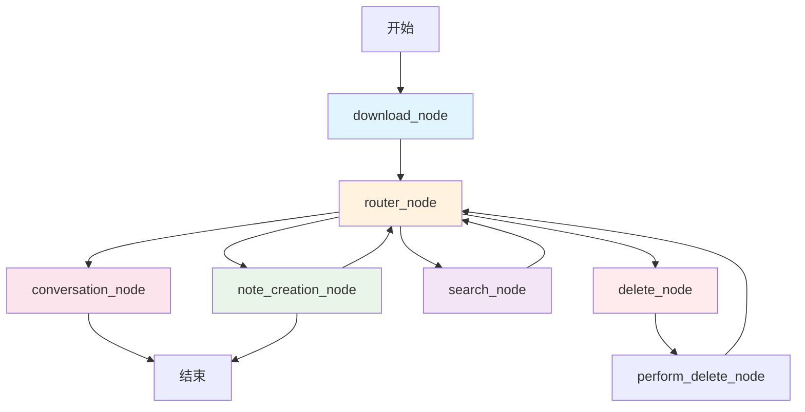

# 小红书文案生成 CoAgent

这是一个基于 CopilotKit 和 LangGraph 的智能小红书文案生成系统，集成了 RAG(Retrieval-Augmented Generation) 文案库检索功能。

## 🌟 功能特性

- **📝 智能文案生成**: 基于产品信息和用户需求生成小红书文案
- **👤 博主人设创建**: 自动生成符合产品特色的博主人设
- **📚 文案库检索**: 集成 RAGFlow，从真实文案库中检索相关示例
- **📋 Brief 解析**: 支持上传 Brief 表格，自动解析产品信息
- **🔍 智能搜索**: 搜索竞品信息和市场趋势
- **🎯 多样化风格**: 支持种草、测评、教程、生活方式、开箱等多种笔记风格

## 🏗️ 系统架构

### LangGraph 工作流程图



### 节点功能说明

| 节点名称 | 功能描述 | 路由目标 |
|---------|---------|---------|
| **download_node** | 处理文件下载和Brief数据解析 | → router_node |
| **router_node** | 智能意图识别和消息路由 | → conversation_node/note_creation_node/search_node/__end__ |
| **conversation_node** | 处理普通对话和功能咨询 | → END |
| **note_creation_node** | 核心文案生成和RAG检索 | → router_node/__end__ |
| **search_node** | 外部搜索和竞品分析 | → router_node |
| **delete_node** | 删除参考素材确认 | → perform_delete_node |
| **perform_delete_node** | 执行删除操作 | → router_node |

### 工具系统

#### note_creation_node 可用工具

- **WriteXiaohongshuNote**: 创作小红书笔记内容
- **WriteProductInfo**: 填写/更新产品信息
- **GenerateBloggerPersona**: 生成博主人设
- **RetrieveFromKnowledgeBase**: 🆕 从文案库检索相关示例
- **Search**: 搜索外部参考资料
- **AnalyzeCompetitors**: 分析竞品内容
- **DeleteReferenceMaterials**: 删除参考素材

## 🔧 RAG 检索系统

### 架构设计

```
用户输入 → router_node → note_creation_node → RetrieveFromKnowledgeBase Tool
                                                           ↓
RAGFlow API ← rag_retrieval_node ← RAGFlowProvider ← build_retriever
     ↓
返回相关文案示例 → 格式化输出 → 用户界面
```

### 核心组件

#### 1. RAG 模块 (`research_canvas/rag/`)

- **`retriever.py`**: 抽象检索接口定义
- **`ragflow_provider.py`**: RAGFlow API 集成实现
- **`builder.py`**: RAG 提供者构建器

#### 2. RAG 节点 (`research_canvas/langgraph/rag_node.py`)

- **查询构建**: 从 Brief 数据和产品信息智能构建检索查询
- **资源管理**: 支持多数据集配置和资源构建
- **结果处理**: 相似度过滤和格式化输出

### 检索流程

1. **状态检查**: 验证 Brief 数据或产品信息是否存在
2. **查询构建**: 提取关键信息构建智能检索查询
3. **资源构建**: 根据配置构建 RAGFlow 资源列表
4. **API调用**: 调用 RAGFlow API 进行文档检索
5. **结果过滤**: 基于相似度阈值过滤结果
6. **格式化**: 返回结构化的文案示例

## 🚀 快速开始

**这些说明假设你在 `coagents-xhs-generation/` 目录中**

### 快速启动（Python Agent）

#### 1. 设置 Python Agent

```bash
cd agent
poetry install
echo "OPENAI_API_KEY=your_key_here" > .env
```

配置 `.env` 文件中的必要环境变量：
```bash
# DeepSeek V3 on Volcano Engine 配置
TAVILY_API_KEY=your_tavily_api_key
OPENAI_API_KEY=your_openai_api_key
OPENAI_BASE_URL=https://ark.cn-beijing.volces.com/api/v3
DEEPSEEK_MODEL=your_model_endpoint

# RAG 配置
MODEL=deepseek
RAG_PROVIDER=ragflow
RAGFLOW_API_URL="http://your_ragflow_server:port"
RAGFLOW_API_KEY="your_ragflow_api_key"

# XHS RAG 配置
XHS_DATASET_ID="your_dataset_id"
XHS_DATASET_IDS=""
XHS_MAX_RESULTS=10
XHS_SIMILARITY_THRESHOLD=0.3

# 代理配置 - 排除 localhost
NO_PROXY=localhost,127.0.0.1,0.0.0.0
no_proxy=localhost,127.0.0.1,0.0.0.0
```

#### 2. 运行 Agent

```bash
poetry run demo
```

如果遇到 "No checkpointer set" 错误：
```bash
LANGGRAPH_API=true poetry run demo
```

#### 3. 设置并运行 UI（在新终端中）

```bash
cd ui
pnpm install
echo "OPENAI_API_KEY=your_key_here" > .env
```

配置 UI 的 `.env` 文件：
```bash
# DeepSeek V3 on Volcano Engine 配置
TAVILY_API_KEY=your_tavily_api_key
OPENAI_API_KEY=your_openai_api_key
OPENAI_BASE_URL=https://ark.cn-beijing.volces.com/api/v3
DEEPSEEK_MODEL=your_model_endpoint

# 远程 action URL，用于连接到 agent
REMOTE_ACTION_URL=http://localhost:8000

# 代理配置 - 排除 localhost
NO_PROXY=localhost,127.0.0.1,0.0.0.0
no_proxy=localhost,127.0.0.1,0.0.0.0
```

运行 UI：
```bash
NO_PROXY=localhost,127.0.0.1 pnpm run dev
```

#### 4. 打开 [http://localhost:3000](http://localhost:3000)（或显示的端口）

UI 已配置为连接到运行在端口 8000 上的 Python agent。

### 运行 Agent

首先，安装后端依赖：

#### Python Agent

```bash
cd agent
poetry install
```

设置环境变量（创建 `.env` 文件）：
```bash
# 必需的 API 密钥
OPENAI_API_KEY=your_openai_api_key
TAVILY_API_KEY=your_tavily_api_key  # 用于搜索功能

# DeepSeek/Volcano Engine 配置（可选）
OPENAI_BASE_URL=https://ark.cn-beijing.volces.com/api/v3
DEEPSEEK_MODEL=your_model_endpoint

# RAG 配置（可选）
RAG_PROVIDER=ragflow
RAGFLOW_API_URL="http://your_ragflow_server:port"
RAGFLOW_API_KEY="your_ragflow_api_key"
XHS_DATASET_ID="your_dataset_id"
```

启动 agent：
```bash
poetry run demo
```

#### 运行前端

```bash
cd ui
pnpm install
```

创建 `.env` 文件并配置：
```bash
# 必需 - 与 agent 相同的 API 密钥
OPENAI_API_KEY=your_openai_api_key

# 可选 - DeepSeek/Volcano Engine 配置
OPENAI_BASE_URL=https://ark.cn-beijing.volces.com/api/v3
DEEPSEEK_MODEL=your_model_endpoint

# Agent 连接配置
REMOTE_ACTION_URL=http://localhost:8000
```

启动 UI：
```bash
NO_PROXY=localhost,127.0.0.1 pnpm run dev
```

## 💡 使用方法

### 基本工作流程

1. **上传 Brief 表格** - 系统自动解析产品信息
2. **生成博主人设** - 创建符合产品特色的博主人设
3. **检索文案库** - 从 RAG 文案库中获取相关示例
4. **生成小红书文案** - 基于产品信息和检索结果创作内容

### 支持的操作

- **Brief 上传**: 上传包含产品信息的 Excel 表格
- **手动填写**: 在界面中填写产品名称、类别、卖点等信息
- **文案库检索**: 输入"帮我检索文案库"或"查找XX相关的文案示例"
- **内容生成**: 生成多种风格的小红书笔记内容
- **竞品分析**: 搜索和分析竞品信息
- **素材管理**: 删除和管理参考素材

## 📊 配置参数

### RAG 检索参数

| 参数 | 默认值 | 说明 |
|-----|--------|-----|
| `XHS_MAX_RESULTS` | 10 | 最大检索结果数量 |
| `XHS_SIMILARITY_THRESHOLD` | 0.3 | 相似度过滤阈值 |
| `RAGFLOW_PAGE_SIZE` | 10 | RAGFlow API 分页大小 |

### 支持的笔记风格

- **grass_planting**: 种草文案
- **review**: 测评内容  
- **tutorial**: 教程指南
- **lifestyle**: 生活方式
- **unboxing**: 开箱体验

## 🔧 故障排除

### 常见问题

#### 1. UI 聊天框输入内容后端 Agent 收不到

**症状**: 在 UI 中输入消息后，Agent 终端没有收到请求

**解决方案**:
1. **检查代理设置**: 确保在启动命令中使用了 `NO_PROXY=localhost,127.0.0.1`
2. **验证端口**: 确认 Agent 运行在 8000 端口，UI 中 `REMOTE_ACTION_URL=http://localhost:8000`
3. **启用调试日志**: 在 UI 中设置 `showDevConsole={true}` 查看详细错误
4. **检查网络连接**: 运行 `curl http://localhost:8000/health` 测试 Agent 连接

#### 2. RAG 检索返回 0 结果

**解决步骤**:
1. **检查数据集配置**: 确认 `XHS_DATASET_ID` 正确
2. **验证 API 连接**: 检查 RAGFlow 服务状态
3. **调整相似度阈值**: 降低 `XHS_SIMILARITY_THRESHOLD`
4. **查看详细日志**: 检查查询构建和 API 响应

#### 3. Brief 数据解析失败

**解决步骤**:
1. **检查文件格式**: 确保为支持的 Excel 表格格式
2. **验证字段映射**: 确认必要字段存在
3. **查看解析日志**: 检查字段提取过程

#### 4. DeepSeek API 兼容性问题

**症状**: 出现 `invalid value: developer` 错误

**解决方案**: 已在代码中处理，这些警告不影响功能正常使用

### 调试技巧

1. **启用开发者控制台**: 在 `page.tsx` 中设置 `showDevConsole={true}`
2. **查看网络请求**: 使用浏览器开发者工具监控 `/api/copilotkit` 请求
3. **检查环境变量**: 确认所有必需的 API 密钥都已正确配置
4. **测试 Agent 连接**: 使用 `curl` 测试 Agent 健康检查端点

## 🛠️ 开发和扩展

### 自定义配置

- **RAG 提供者**: 支持扩展其他检索系统
- **工具函数**: 可添加新的 LangGraph 工具
- **路由逻辑**: 支持自定义意图识别和消息路由
- **UI 组件**: 基于 CopilotKit React 组件构建

### 性能优化建议

- 根据数据质量调整相似度阈值（`XHS_SIMILARITY_THRESHOLD`）
- 控制检索结果数量平衡质量和速度（`XHS_MAX_RESULTS`）
- 优化查询构建逻辑提高检索相关性
- 利用 RAGFlow 内置缓存机制

## 📄 许可证

本项目采用 MIT 许可证。

---

🤖 Generated with [Claude Code](https://claude.ai/code)